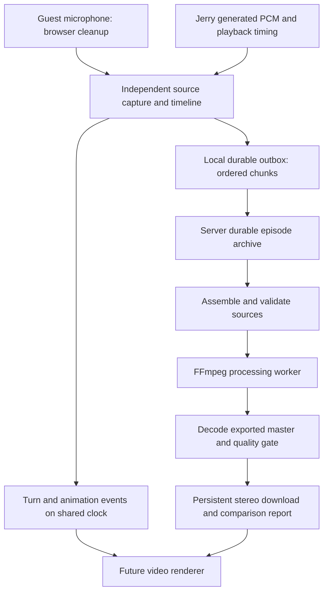

# Jerry podcast: context, evidence and target architecture

Updated: 2026-09-27. Audited code: `e0b0105`, branch `feature/jerry-live-animation-recording`.

## Product contract

Two speakers: a human guest and Jerry. Support Hebrew, English, and code-switching within a turn. Capture both speakers reliably, preserve source recordings, produce a balanced stereo publication master, and provide a persistent download. Later render Jerry's full-frame pose animation against the same audio timeline. Runtime reference videos and a puppet rig are out of scope.

This is a local-first POC. Multi-user hosting, authentication and retention policy need explicit design before exposing private recordings remotely. Recordings are not training data automatically; comparison means local quality analysis unless the user explicitly authorizes another use.

## Verified state and limits

- Local application returned HTTP 200 and debug endpoint returned `ok: true` during this review. This proves service availability, not a successful current conversation or export.
- Latest audited worktree is NOT `C:\gerryy` main. It is `C:\Users\longy\.config\superpowers\worktrees\gerryy\jerry-live-animation-recording`.
- Storage resolves from `process.cwd()`. For the running worktree, recordings live under that worktree's `recordings` directory, not `C:\gerryy\recordings` as previously claimed.
- 61 existing tests and TypeScript checking passed in the preceding audit. Finalizer tests largely match source strings rather than execute real audio processing.
- Both saved raw WebM recordings emit `Error parsing Opus packet header` in FFmpeg. FFmpeg recovers decodable audio; browser decode fails. The exact origin of malformed packets is not yet established.
- The 8-second recording has effectively silent Jerry-left audio and Guest-right audio at approximately -35.07 dBFS whole-file RMS. It is not a valid two-speaker acceptance fixture. The longer recording has Jerry/Guest RMS approximately -17.69/-35.27 dBFS. These are whole-file statistics, not speech loudness measurements.
- Each saved processed file has the same SHA-256 as its raw file: these are fallback copies, not successful processed masters.
- Current finalizer fails closed on decode failure. No FFmpeg production worker exists in the application; manual repair by a coding agent does not constitute an integrated processing service.

## What previous verification missed

1. Container metadata and file size do not establish audible content, decoding integrity or balance.
2. Near -80 dBFS during a guest pause does not establish a defective guest microphone. Live balance includes silence and measures before output processing.
3. Browser smoke coverage used microphone-denied/Jerry-only capture; it did not validate the two-source success path.
4. No test awaited a real download and decoded the downloaded bytes.
5. An effect depending on download URLs runs global cleanup when URLs change, not only on unmount. This can revoke earlier links and stop unrelated live resources (`JerryPodcastStudio.tsx`, around line 1208).
6. Preservation happens after stop; a refresh before upload still loses capture. Upload errors are not handled as a recoverable workflow, and raw/processed writes overwrite paths directly.
7. Dedicated stems and full turn logs are not persisted. The finalizer receives only the master. The manifest contains counts, not the timeline or complete quality evidence.
8. Transcription is Hebrew-biased and the persona explicitly treats other languages as mistakes (`server.ts`, rules 20–21).
9. Clearing playback is not server generation cancellation. Interruption records have a separate, unexported timeline and measure until guest silence rather than actual simultaneous audio.
10. “Stereo” currently means Jerry only left and Guest only right. A stereo publication mix is a separate product decision from isolated speaker tracks.
11. The finalizer uses whole-file RMS, sample peaks, and sample clamping; it does not measure LUFS or true peak. Finite quiet noise can pass the current gate, and mono input is not robustly rejected as a two-speaker product.
12. Generic catch logic labels all failures as decode problems. Debug is a 200-event in-memory ring, loses history on restart and truncates strings; elapsed finalizer time excludes storage and download readiness.

## Target data flow



Capture must not depend on React render rate or foreground animation frames. Prefer AudioWorklet-based metering/capture when replacing current ScriptProcessor/rAF processing. Preserve existing live interaction until the replacement has passed recording tests.

The production worker orchestrates deterministic media tools. An LLM may explain a report but is not required to process samples. Process each speaker separately, preserve Jerry's expressive dynamics, then create the publication mix and validate the encoded output. If source decoding recovered damaged packets, retain diagnostics and require review; never silently certify damaged input.

## Episode archive and state

Use one episode UUID created before capture, recording attempt ID, processing job ID and pipeline version. Configure an absolute storage root and show the resolved path to the operator.

```text
episodes/<episode-id>/
  manifest.json
  chunks/<source>/<sequence>.bin
  sources/guest.*
  sources/jerry.*
  sources/captured-master.*
  timeline.json
  jobs/<job-id>/diagnostics.json
  jobs/<job-id>/metrics-before.json
  jobs/<job-id>/metrics-after.json
  jobs/<job-id>/master-stereo.wav
  jobs/<job-id>/master-stereo.mp3
```

Chunk payloads preserve ordered stream bytes: individual MediaRecorder chunks need not be independently decodable. Reassemble in order. Persist hashes, sample counts/rates, offsets, MIME types, processing parameters, source completeness, timestamps and errors. Write atomically; a retry must be idempotent, conflicting bytes must not replace the original. A failed job retains sources and diagnostics, not a falsely named processed copy.

Lifecycle: `capturing -> saving -> captured -> queued -> validating -> processing -> verifying -> ready | needs-review | failed`. Track capture completeness separately from publication status. `ready` requires disk persistence and output verification; only then expose the publication download. Raw recovery downloads remain explicitly labeled originals.

Progress records stage, elapsed time, last heartbeat, job ID, reason code and next action. Distinguish decode, upload, processing, verification and storage errors. Persist job events beyond the transient debug buffer. On reload, recover the local outbox and reload archived episodes/jobs.

## API contracts to implement

- `POST /api/episodes`: allocate ID and manifest.
- `PUT /api/episodes/:id/chunks/:source/:sequence`: bounded binary upload, checksum and durable acknowledgement.
- `POST /api/episodes/:id/complete`: declare expected chunks/source durations and persist timeline; reject gaps.
- `POST /api/episodes/:id/jobs`: enqueue versioned processing; prevent duplicate active jobs.
- `GET /api/episodes` and `GET /api/episodes/:id`: recovery/library and manifest.
- `GET /api/episodes/:id/jobs/:jobId`: stage, timings and quality report.
- `GET /api/episodes/:id/artifacts/:artifactId`: validated archive lookup, correct MIME, Content-Disposition and range support.

No arbitrary filesystem path parameters. Preserve recordings outside public assets and Git. Bound jobs, upload size and memory. Use subprocess argument arrays and timeouts. No silent eviction of original recordings.

## Publication acceptance targets (proposed product targets)

- Two independently verified sources with audible speech; reject silence, wrong source routing and incomplete capture.
- Stereo encoded output; proposed listening mix places both voices in both ears with mild separation. Retain hard-separated sources separately. Final pan choice remains a product choice.
- Target integrated stereo loudness -16 LUFS ±1 LU and true peak at most -1 dBTP, measured after final encoding. These are proposed targets, not a claim that current code implements them.
- Speech-only speaker loudness difference at most 3 LU, comparing each speaker's own active segments. Exclude pauses from speaker matching and flag insufficient speech.
- Do not amplify background noise to pass the gate. No audible pumping, clipped syllables or lost expressive breaths in human listening review.
- For short local episodes, target completion within 30 seconds for a 10-second sample and within 2 minutes for a 2-minute sample. Benchmark on this machine; timeout is not proof of speed.
- Download survives page reload and server restart and matches archived bytes by hash.
- Hebrew, English and mixed-language fixtures preserve meaning, language switches, turn order and speaker identity.

## Future animation

Keep full-frame pose swap. Record actual playback sample timing, interruption boundaries, pose transitions and mouth envelopes on the episode clock. Keep processing duration/timing invariant or export an explicit time mapping. The video renderer must use the final audio plus this timeline, not live wall-clock callbacks. Render an MP4 preview and measure A/V drift before adding video to publication acceptance.

## Release and rollback

Main and the feature worktree differ; choose and document the deployed commit. Preserve a known baseline tag and data schema version before rollout. Rollback changes application code without deleting recordings. New archive versions must remain readable after rollback or provide a documented migration. Previous commits are recovery points, not certified good releases.
